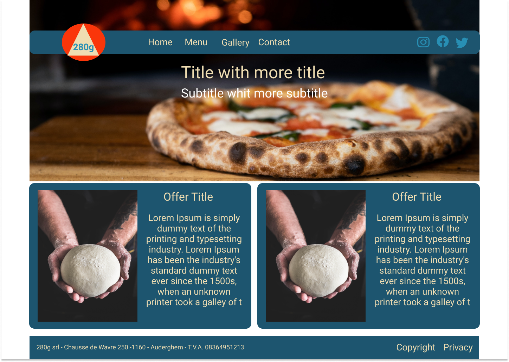
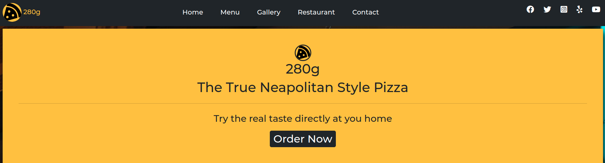
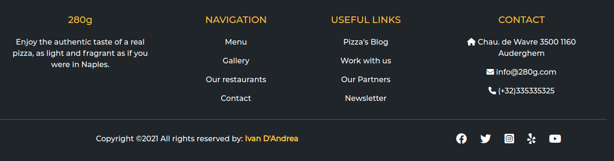
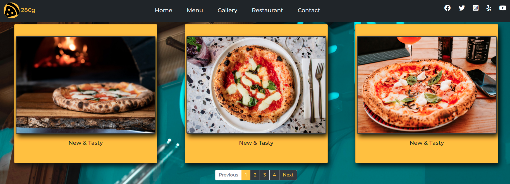
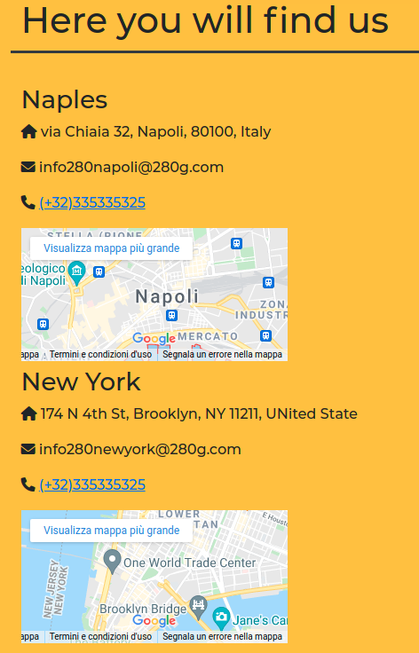
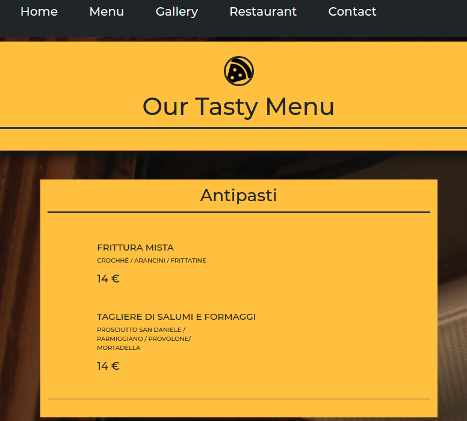

# restaurant-css-framework-project

# 280g - "traditional neapolitan pizza"
---
280g is a pizzeria windows web page built with Bootstrap 4.
This site is responsive and was develloped with  a mobile first approch.

[Link to the page](https://ivandandrea86.github.io/restaurant/)

## Instruction
---
Create a repository called restaurant-css-framework in which you must realise a window web page for a restaurant. The franchise is fictive, but the type of food (burger, pizza, asian, …​) is your choice.

The website must be responsive, at least for small and medium screens. It must at least have five accessible pages: welcome, menu, pictures, restaurants and contact.

This web page will contains:

1. Welcome  
A page with one Jumbotron and two panels to show news (promo, events, etc…​).

2. Menu  
A page with the restaurant menu in the form of a grouped list with badges.

3. Pictures  
A page with a gallery of minimum 10 pictures and a pagination (3 photos per page).

4. Restaurant  
A page about the restaurants (it’s a franchise) with its addresses, a map, and different schedules.

5. Contact  
A page with a contact form containing the firstname, lastname, email, subject of the message (a drop-down list with multiple options), an area for the message itself and a send button with an icon. Each entry as a title in a semantically correct tag.

[Link to the instraction](https://github.com/becodeorg/BXL-Swartz-5.34/blob/main/1.The-Field/10.Bootstrap/restaurant.adoc)

## Languages used
---
- HTML
- CSS
  
## Framework
---

- Bootstrap 5

## Wireframe
---
I used figma to create a draft design using a grid layout
you can finde the pdf varsion in the repository.

)

During the development phase I changed colours and style to make the visual part better.

## Features
- Responsive Mobile firse developed.
- Gallery with pagination.
- Contact Form.
- Google maps integration.
- Navigation bar.

## Screenshots

Here some screenhots of the v 1.0 version:

 
 

 
 

 
 

 
 

 
 
  

## Image and Icons License
---
All the images adn logos i used are on free licese on 

- [Unsplash](https://unsplash.com/)
 

- [Font Awesome](https://fontawesome.com/)

